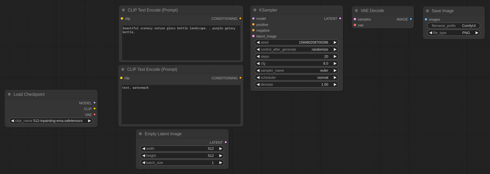

# AutoConnect for ComfyUI

This extension will add an Autoconnect button to ComfyUI’s application menu. When clicked (or when the Alt-A shortcut key is pressed), the extension will try to match any inputs not yet connected to the available outputs and create the corresponding links. While the heuristics involved might occasionally go wrong for complicated workflows, they usually connect nodes as intended.

Before clicking Autoconnect:

After clicking Autoconnect:

## Installation

To install, clone this repository into `ComfyUI/web/extensions` folder with `git clone https://github.com/palant/autoconnect-comfyui` and reload ComfyUI in the browser.
